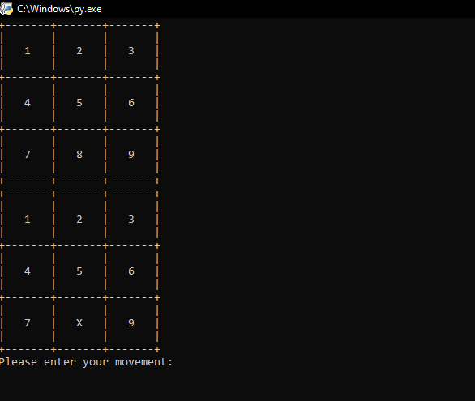
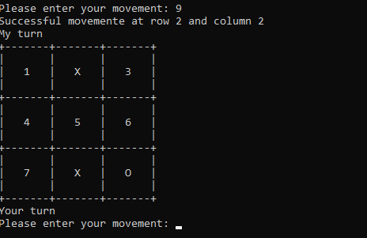

# This is the final project for the Python Fundamentals 1 course - Cisco [SkillsForAll](https://www.skillsforall.com/).

## Table of contents

- [Overview](#overview)
   - [The challenge](#the-challenge)
   - [Screenshot](#screenshot)
   - [Links](#links)

- [My process](#my-process)
   - [What I learned](#what-i-learned)
   - [Continued development](#continued-development)
   

- [Author](#author)


## Overview

### The challenge

This is a copy-paste for the given challenge at SkillsForAll:

Your task is to write a simple program which pretends to play tic-tac-toe with the user. To make it all easier for you, we've decided to simplify the game. Here are our assumptions:

- the computer (i.e., your program) should play the game using 'X's;
- the user (e.g., you) should play the game using 'O's;
- the first move belongs to the computer − it always puts its first 'X' in the middle of the board;
- all the squares are numbered row by row starting with 1 (see the example session below for reference)
- the user inputs their move by entering the number of the square they choose − the number must be valid, i.e., it must be an integer, -it must be greater than 0 and less than 10, and it cannot point to a field which is already occupied;
- the program checks if the game is over − there are four possible verdicts: the game should continue, the game ends with a tie, you - win, or the computer wins;
- the computer responds with its move and the check is repeated;
- don't implement any form of artificial intelligence − a random field choice made by the computer is good enough for the game.

Implement the following features:

- the board should be stored as a three-element list, while each element is another three-element list (the inner lists represent rows) so that all of the squares may be accessed using the following syntax:

  ```py
  board[row][column]
  ```
- each of the inner list's elements can contain 'O', 'X', or a digit representing the square's number (such a square is considered free)
- the board's appearance should be exactly the same as the one presented in the example.
- implement the functions defined for you in the editor.

### Screenshots




### Links

- Solution URL: [GitHub repo](https://github.com/light-roast/simple_tic_tac_toe)


## My process

During this project, the first main challenge was to draw the board as intended, especially the parts that will hold 'O's and 'X's.
After that, the SkillsForAll course gives separate pieces of functions that the user should define to make the game playable, which I based on to complete the whole game. The most difficult function to implement was the victory_for function because it was in charge of checking if a player (user or computer) wins on each turn. The most challenging part was the one that checks if there is a player that wins by completing a cross filling on the board. I had to consult the Internet and use the help of Chat GPT to gain knowledge on how to do that cross-check.

Here are the functions that needed to be implemented:
  ```py
  def display_board(board):
      # The function accepts one parameter containing the board's current status
      # and prints it out to the console.


  def enter_move(board):
      # The function accepts the board's current status, asks the user about their move, 
      # checks the input, and updates the board according to the user's decision.


  def make_list_of_free_fields(board):
      # The function browses the board and builds a list of all the free squares; 
      # the list consists of tuples, while each tuple is a pair of row and column numbers.
  
  def victory_for(board, sign):
    # The function analyzes the board's status in order to check if 
    # the player using 'O's or 'X's has won the game


  def draw_move(board):
    # The function draws the computer's move and updates the board.


  ``` 


### What I learned

I had the chance to learn a little bit about the random module and its functionality to implement the draw_move function. This gave me insight into how, in Python like in JavaScript, modules can be imported to make use of functionalities that will allow me to do things better and solve problems using different approaches.

Also, it was refreshing to work with [row][columns] lists because of the challenges that this type of dataset imposes on developers.


### Continued development

I would like to delve deeper into Python learning and implement this knowledge to learn how to do back-end development using Python libraries.
## Author

- Website - [Daniel Echeverri LLano](https://light-roast.github.io/portafolio/)
- Frontend Mentor - [@light-roast](https://www.frontendmentor.io/profile/light-roast)
- Twitter - [@echeverri_llano](https://www.twitter.com/echeverri_llano)


```sh

```